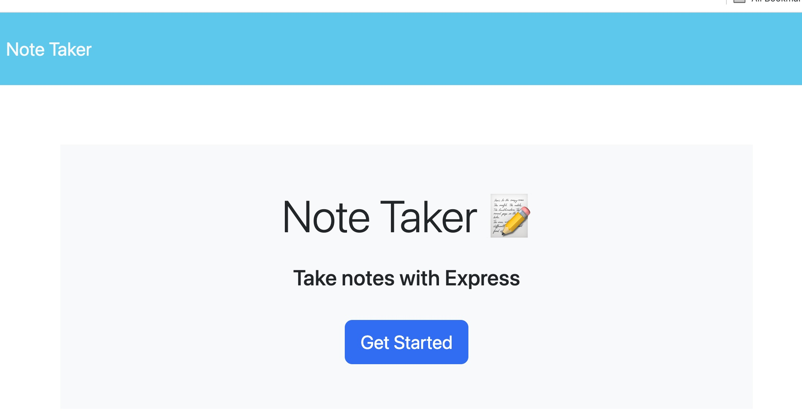
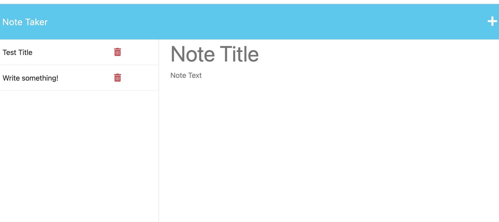
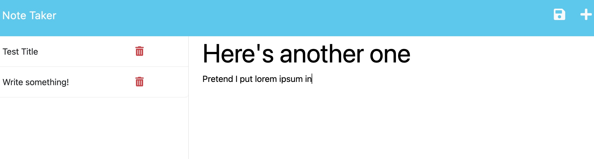
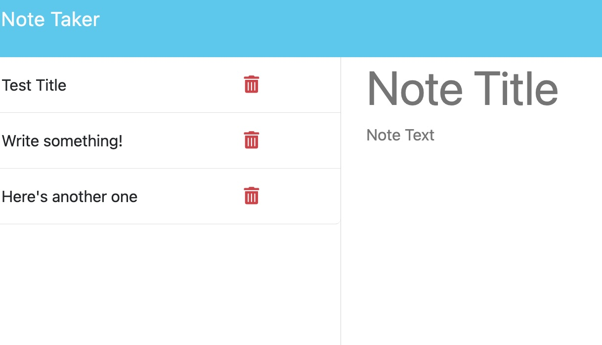

# Note to self

### The assignment

- Using starter code, create a note-taker application that can write and save notes.

- Use an Express.js backend.

- Save and retrieve notes from a JSON.

- Write routes and properly connect the backend to the frontend.

- Deploy the whole thing to Heroku.

### Heroku Deployment address
 https://note-to-self-routes-6f531153ee0a.herokuapp.com/

### Application screenshots

 

<!-- apparently I have to wait a couple hours to see if it's functioning. -->